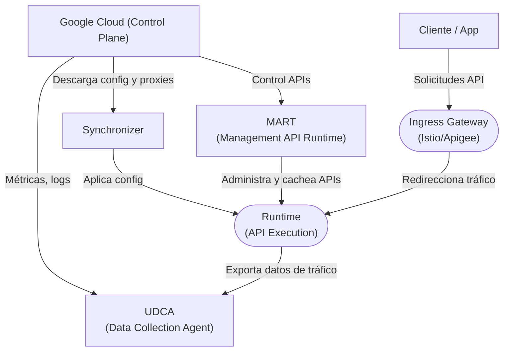

# Arquitectura y Componentes de Apigee Hybrid

## 1. Diagrama de Arquitectura (Visual mental)

```ascii
             Google Cloud (Plano de control central)
             ┌────────────────────────────────────┐
             │  Apigee Control Plane (Cloud)      │
             │  - Dev Portal                      │
             │  - Apigee UI / API                 │
             │  - Analytics backend               │
             └────────────▲──────────────▲────────┘
                          │              │
                          │              │
            (sync, auth, metrics)     (API management)
                          │              │
                    ┌─────┴─────┐  ┌─────┴─────┐
                    │ MART      │  │ UDCA      │
                    │ (Mgmt API)│  │ (Telemetry│
                    └─────▲─────┘  └─────▲─────┘
                          │              │
                          │              │
                 ┌────────┴────────┐     │
                 │ Synchronizer    │◄────┘
                 │ (config sync)   │
                 └────────▲────────┘
                          │
               ┌──────────┴─────────────┐
               │  Apigee Runtime Plane  │ (en tu clúster K8s/OKD)
               │                        │
               │ - Runtime pods         │
               │ - Ingress Gateway      │
               │ - Istio (opcional)     │
               └────────────────────────┘
```
## 2. Componentes Clave

| Componente | Rol Principal |
| :--- | :--- |
| **MART** | Exponer las APIs de administración de Apigee desde el clúster. |
| **Synchronizer** | Sincroniza la configuración del runtime con el control plane de GCP. |
| **UDCA** | Envía métricas y logs (analytics) hacia Google Cloud. |
| **Runtime Pods** | Ejecutan las llamadas de tus APIs (el data plane). |
| **Ingress Gateway** | Maneja el ingreso HTTP/HTTPS de tráfico de clientes externos. |
| **Istio (opcional)** | Puede integrarse con Apigee para manejar tráfico. |

## 3. Diagrama de flujo de componentes



